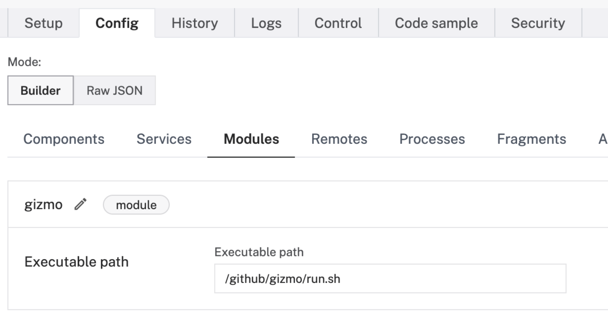
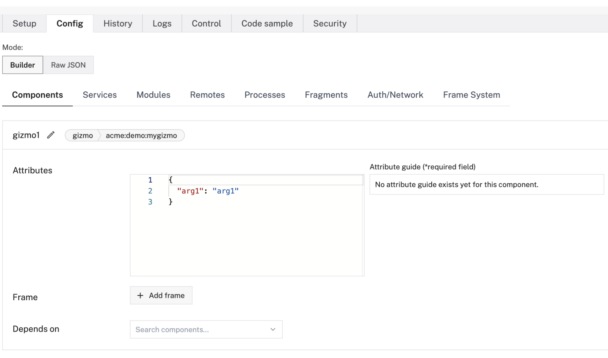

# VIAM Custom Module/Resource Example
This example goes through how to create custom modular resources using Viam's python SDK, and how to connect it to a Robot.

This is a limited document. For a more in-depth understanding of modules, see the [documentation](https://docs.viam.com/program/extend/modular-resources/).

## Purpose
Modular resources allows you to define custom components and services, and add them to your robot. Viam ships with many component types, but you're not limited to only using those types -- you can create your own using modules.

For more information, see the [documentation](https://docs.viam.com/program/extend/modular-resources/).

## Project structure
The definition of the new resource is in the `src` directory. Within this directory are the `proto` and `gizmo` subdirectories.

The `proto` directory contains the `gizmo.proto` definition of all the message types and calls that can be made to the Gizmo component. It also has the compiled python output of the protobuf definition.

The `gizmo` directory contains all the necessary definitions for creating a custom `Gizmo` component type. The `api.py` file defines what a `Gizmo` can do (mirroring the `proto` definition), implements the gRPC `GizmoService` for receiving calls, and the gRPC `GizmoClient` for making calls. See the [API docs](https://docs.viam.com/program/extend/modular-resources/#apis) for more info. The `my_gizmo.py` file in contains the unique implementation of a `Gizmo`. This is defined as a specific `Model`. See the [Model docs](https://docs.viam.com/program/extend/modular-resources/#models) for more info. This implementation uses the `validate_config` function to specify an implicit dependency on a `arg1` parameter by default and throw an error if there is an `invalid` attribute.

There is also a `main.py` file, which creates a module, adds the desired resources, and starts the module. This file is called by the `run.sh` script, which is the entrypoint for this module. Read further to learn how to connect this module to your robot.

Outside the `src` directory, there is the `client.py` file. This can be used to test the module once it's connected to the robot. You will have to update the credentials and robot address in that file.

## How to use
These steps assume that you have a robot available at [app.viam.com](app.viam.com).

The `run.sh` script is the entrypoint for this module. To connect this module with your robot, you must add this module's entrypoint to the robot's config. For example, this could be `/home/viam-python-sdk/examples/module/run.sh`. See the [documentation](https://docs.viam.com/program/extend/modular-resources/#use-a-modular-resource-with-your-robot) for more details.



Once the module has been added to your robot, you will then need to add a component that uses the `MyGizmo` model. See the [documentation](https://docs.viam.com/program/extend/modular-resources/#configure-a-component-instance-for-a-modular-resource) for more details. You can add a service in a similar manner.

An example configuration for a Gizmo component could look like this:
```json
{
  "components": [
    {
      "name": "gizmo1",
      "type": "gizmo",
      "namespace": "acme",
      "model": "acme:demo:mygizmo",
      "attributes": {
        "arg1": "arg1",
      },
      "depends_on": []
    }
  ],
  "modules": [
    {
      "name": "gizmo",
      "executable_path": "/github/gizmo/run.sh"
    }
  ]
}
```




After the robot has started and connected to the module, you can use the provided `client.py` to connect to your robot and make calls to your custom, modular resources.

